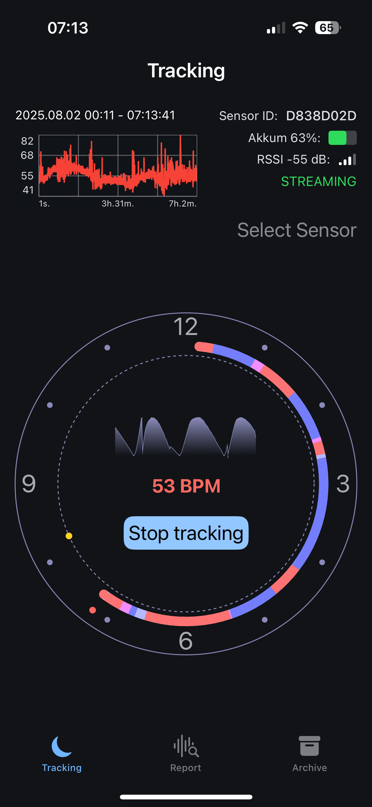

# SleepAnalyzerLiteIOS

> 💤 iOS sleep tracking app using real-time heart rate sensors (Polar Verity Sense, Polar OH1+, etc.).

SleepAnalyzerLiteIOS is an open-source app that collects heart rate data during sleep and visualizes hypnograms, sleep phases, and long-term statistics.

It integrates with BLE sensors from **Polar** to provide detailed insight into sleep architecture and heart performance overnight.

---

## 📲 App Screenshots & Features

### 🟢 Tracking Mode
Live visualization of heart rate stream, sensor status, and circular hypnogram clock.

    

### 📊 Report Mode
Displays day-by-day analysis: min/avg/max heart rate and stacked hypnogram durations.

    

### 📁 Archive Mode
Scroll through previous nights with visual summaries of sleep structure.

    

### 🔍 Archive Detail View
Sleep phase timeline + heart rate chart for selected night.

    

### 🧪 Debug Mode
Visual overlays of sleep phase predictions and adjustable quantization parameters.

    

---

## 🛠 Technologies
- SwiftUI / Combine
- BLE CoreBluetooth integration
- Custom circular hypnogram rendering
- Modular architecture with `SwiftInjectLite`
- Binary sleep computation module via `HypnogramComputationSP`

---

## 📄 License
MIT © Igor Gun